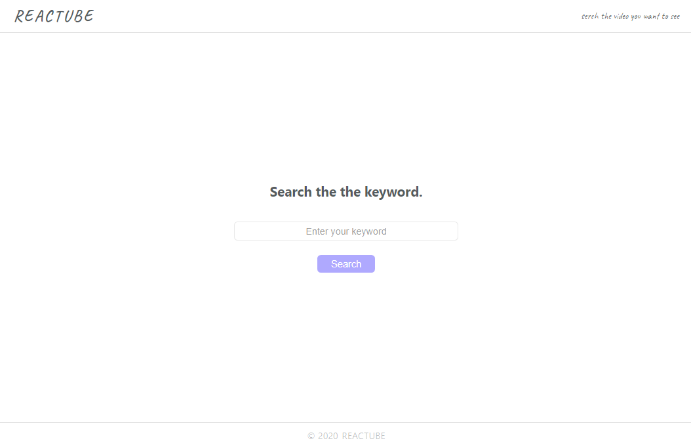
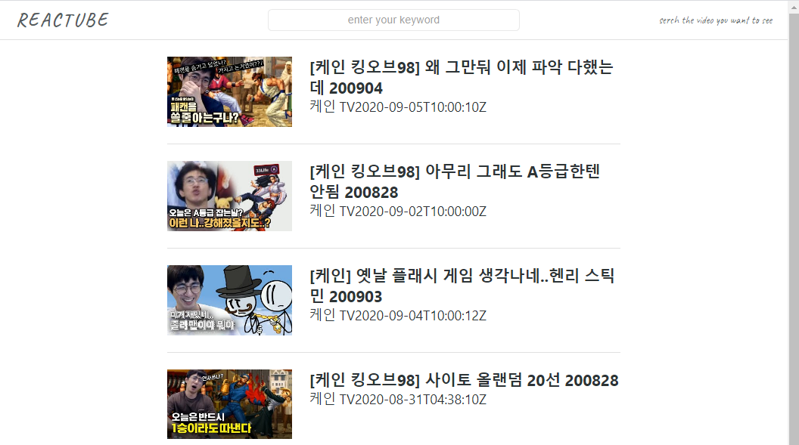

# Reactube

## Link to

[Reactube](taesung1993.github.io/Reactube)

## Introduction

이 앱은 유튜브 API를 이용하여 만든 유튜브 검색 사이트 입니다. 화면에 원하시는 검색어를 입력하면 다 섯개의 비디오가 뜹니다. API의 일일 할당량 때문에 검색 시 다섯 개로 제한하였으니 양해 부탁드립니다.

홈 화면은 다음과 같습니다.

1.  로고를 클릭하면 Home "/" 주소로 이동합니다.
2.  검색을 원할 경우, 입력 창에 원하는 검색어를 입력하시고 엔터를 누르거나, Search 버튼을 누르시면 됩니다.

검색 결과 페이지는 다음과 같습니다.

1.  로고를 클릭하면 Home "/" 주소로 이동합니다.
2.  검색을 원할 경우, 입력 창에 원하는 검색어를 입력하시고 엔터를 누르거나, Search 버튼을 누르시면 됩니다.
3.  검색된 비디오 항목을 마우스로 누르게 되면 해당 비디오의 유튜브 페이지로 이동됩니다.
